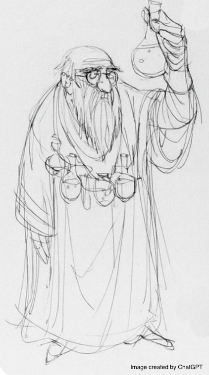

## ALCHEMIST: *Turning Fuel Data into Gold*

**A**IML-powered **L**ow-**c**ost, **H**igh-octane **E**co-fuel **M**ixture **I**dentification **S**trategy & **T**oolkit

Problem Statement
-----------------

The Shell AI Hackathon 2025 focuses on predicting fuel blend properties using machine learning techniques. This challenge involves predicting multiple target properties (BlendProperty1 through BlendProperty10) of fuel blends based on the composition and properties of individual components.

Dataset Overview
-----------------

The problem involves:
- **Input Features**: 5 fuel components, each with:
  - Volume fraction in the blend
  - 10 individual properties per component (Component1\_Property1 through Component5\_Property10)
- **Target Variables**: 10 blend properties that need to be predicted
- **Training Data**: Historical fuel blend data with known outcomes, sample size = 2000
- **Test Data**: New fuel blend compositions requiring property predictions, sample size = 500

Challenging Issues
------------------

1. Multi-Target Regression Complexity

The problem presents a multi-target regression challenge where 10 different blend properties must be predicted simultaneously. The blend properties are interdependent, requiring models that can capture these relationships. 

2. Training Data Limitation

Due to the limited samples (only 2000) in the training set, traditional hyper-parameter tuning-based multioutput regression approaches are impractical.  

3. MAPE as a Metric

It is well-known that MAPE can produce spurious scores for target values close to zero. For most of the targets, zero is close to the core of the distribution. Thus, a handful of faulty predictions can lead to astronomically large MAPE scores.  

ALCHEMIST's Recipe
------------------

Our comprehensive machine learning strategy employs a sophisticated 5-step ensemble approach designed to maximize prediction accuracy while addressing the challenging issues identified above.

Step #1: Preprocessing and Feature Engineering

Given the small sample size, we performed limited feature engineering. We kept the original volume fraction fratures (5 features). We computed `Component_i_Contribution_Property_j = fraction_i × property_i_j` for each component-property pair (50 features). We also computed `WeightedAvg_Property_j = Σ(fraction_i × property_i_j)` across all components (10 features). These total 65 input features are expected to capture both individual component contributions and overall blend characteristics.

Step #2: AutoGluon Out-of-Fold (OOF) Generation

We train separate AutoGluon models for each of the 10 target properties. We utilize 6-hour training time with 'best_quality' preset and 8-fold cross-validation. We generate out-of-fold (OOF) predictions of each target, which prevents data leakage while creating 10 additional features. These auxiliary features capture inter-target correlations without computationally expensive multi-output regression.

Step #3: AIML Modeling with the RealMLP Model

We use 75 total features (65 pre-processed features + 10 AutoGluon-based OOF features) for next-level ML modeling. Based on its stellar performance on the TabArena website (https://huggingface.co/spaces/TabArena/leaderboard), we selected the RealMLP model from the pytabkit toolbox. We used the pre-tuned version of this model with 100 trials of shuffled training data to ensure robustness. We applied 8-fold CV per target. The ensemble predictions are averaged via harmonic mean (with sign preservation) to mitigate MAPE instability near zero values.

Step #4: AIML Modeling with the TabPFN Model

This step is similar to Step #3. Here, we used the newly-developed foundational model called TabPFN. Due to in-context learning, there is no need for training (and hyperparameter tuning) with the TabPFN model. We use 250 trials of shuffled training data as our resampling strategy.

Step #5: Final Ensemble Combination

Based on cross-validation scores and public leaderboard performance (computed on 50% of test data), we strategically combine our models: TabPFN predictions are used for the first 4 targets, while RealMLP predictions are used for the remaining 6 targets. We found that more sophisticated stacking approaches did not yield additional improvements with these two models.

We would like to note that both RealMLP and TabPFN are not included in AutoGluon (version 1.3.1). Thus, our multi-step ALCHEMIST framework benefited by having these two models on top of the AutoGluon stack.

Usage Guide
------------

1. **Prepare Data Structure**

  Create a DATA/ folder containing train.csv and test.csv

  Create an ExtractedDATA/ folder for processed outputs

  Create a Models/ folder for trained model artifacts

3. **Run the Pipeline**:

  Step #1: Preprocessing

    python Step1_Preprocess.py

  Step #2: Generate AutoGluon OOFs

    python Step2_AutoGluon_OOF.py

  Step #3: Run RealMLP models

    python Step3_RealMLP.py

  Step #4: Run TabPFN models

    python Step4_TabPFN.py

  Step #5: Ensemble Models

    python Step5_Ensemble.py

Requirements
------------

The ALCHEMIST package has been tested with:

* python 3.12.11
* autogluon 1.3.1
* numpy 1.26.4
* pandas 2.3.1
* pytabkit 1.5.2
* scikit-learn 1.7.1
* tabpfn 2.1.0

Check https://alchemist-shellai-hackathon-2025.readthedocs.io/en/latest/ for Jupyter Notebooks and other materials. 

AI Assistance 
--------------

Claude.AI (Anthropic) is used for documentation, code restructuring, and performance optimization
